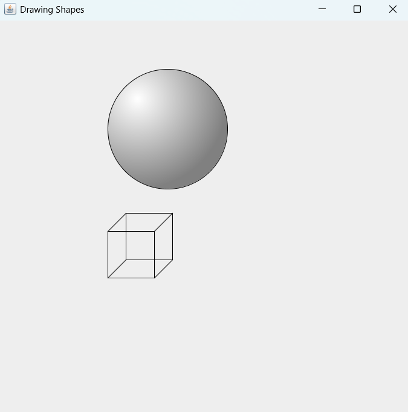

# Java OOP Drawable Shapes Project

This project was developed as part of the Object Oriented Programming course at the Faculty of Computers & Information, Assiut University.

The project is based on converting the given UML design into Java classes and working with drawable shapes using object-oriented programming concepts.

## Project Requirements

The project includes:

* Converting the UML diagram into Java classes.
* Creating a main program to test the classes using a `Drawable` array.
* Reading data from an input file.
* Calculating the total area of the shapes.
* Writing the result to an output file.
* Drawing the shapes using a GUI.

## Shapes Used

The project includes different shape classes such as:

* Circle
* Cube

The classes use inheritance and method overriding to implement the required operations for each shape.

## OOP Concepts Used

Some of the main OOP concepts used in the project are:

* Inheritance
* Abstraction
* Interfaces
* Polymorphism
* Method Overriding
* Encapsulation

## Class Structure

The project is organized into several classes and an interface.

```text
Drawable
├── Circle
└── Cube

Shape
└── Circle

ThreeDShape
└── Cube
```

* `Drawable` defines the drawing behavior.
* `Shape` is used as a base class for shapes.
* `ThreeDShape` is used as a base class for three-dimensional shapes.
* `Circle` extends `Shape` and implements the required drawing and area methods.
* `Cube` extends `ThreeDShape` and implements the required drawing, area, and volume methods.


## File Input and Output

The program reads the shape information from a file named:

`input.txt`

Example input:

```text
2
circle 22.5
cube 23.6
```

The first line represents the number of shapes.

The program then creates the required objects based on the data in the file.

The total area is written to:

`sumAreas.txt`

## GUI

The project includes a simple GUI for displaying the shapes from the input file.

The shapes are drawn using Java `Graphics` methods.

For example, the `Circle` class uses `drawOval()` and the `Cube` class uses `drawRect()`.

### GUI Preview



## Technologies

* Java
* NetBeans
* Java AWT Graphics
* File I/O
* Object Oriented Programming

## Project Structure

```text
src
└── project2026
    ├── Circle.java
    ├── Cube.java
    ├── DrawPanel.java
    ├── Drawable.java
    ├── Shape.java
    ├── ThreeDShape.java
    └── project2026.java

input.txt
sumAreas.txt
build.xml
manifest.mf
```

## How to Run

1. Open the project in NetBeans.
2. Make sure `input.txt` is in the project folder.
3. Run the main class `project2026.java`.
4. The program reads the input file and creates the required shapes.
5. The total area is saved in `sumAreas.txt`.
6. The GUI displays the shapes.

## Academic Information

**University:** Assiut University
**Faculty:** Faculty of Computers & Information
**Course:** Object Oriented Programming

## Author

**Ramy Rashad Zaher Farid**
